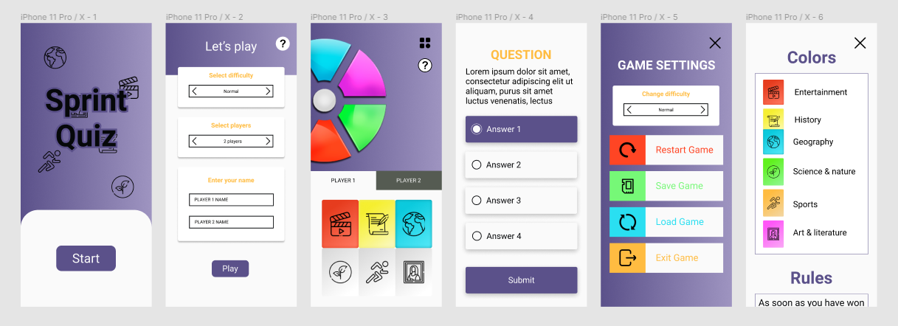
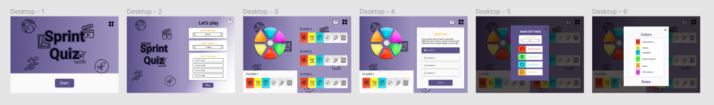

# Sprint Quiz

Aplicación Front-End con React. Juego de preguntas y respuestas con competitivo local.

## Preview

#### Diseño Mobil


<br>

#### Diseño Escritorio


<br>

## Tecnologias

- FIGMA para el diseño de la App
- [REACT](https://es.reactjs.org/)
- [React Router](https://reactrouter.com/web/guides/quick-start)
- [React Hooks](https://es.reactjs.org/docs/hooks-intro.html)

## Instalación

Usar el package manager [npm](https://docs.npmjs.com/) para la instalación.

```
# install dependencies
npm install

# Runs the app in the development mode
npm start

# Runs the app in the development mode.
npm run build
```

## Objetivos

1. Crear un juego de preguntas y respuestas con REACT usando la API [Open Trivia Database](https://opentdb.com/).

2. La aplicación será **responsive** para todos los dispositivos (mobil, tablet, desktop).

3. Modo de juego para una solo jugador, y multijugador de **hasta 4 jugadores** en local.

4. Poder seleccionar **3 niveles de dificultad** para las preguntas.

5. Guardado de las partidas en el **LocalStorage** para poder continuarlas más tarde.
